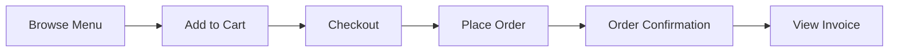

# 🎯 SIMPLE-POS Repository Overview

**Last Updated:** October 10, 2025  
**Status:** ✅ Production Ready & Actively Processing Orders

---

## 📋 Quick Facts

| Aspect | Details |
|--------|---------|
| **Type** | Multi-tenant Point of Sale (POS) System |
| **Frontend** | React 18 + TypeScript + Vite |
| **Backend** | Supabase (PostgreSQL + Auth + Storage) |
| **Styling** | TailwindCSS (Mobile-first) |
| **Architecture** | Multi-tenant with Row Level Security |
| **Active Tenant** | Kopi Pendekar (Coffee Shop) |
| **Database Records** | 79 total across 11 tables |

---

## 🏗️ Architecture Overview

### Three-Tier Access Control

```
┌─────────────────────────────────────────┐
│     Platform Super Admin                │
│     /sadmin/dashboard                   │
│     - Manage all tenants                │
│     - Create/edit/delete tenants        │
│     - Add tenant admins                 │
└─────────────────────────────────────────┘
                  ↓
┌─────────────────────────────────────────┐
│     Tenant Admin                        │
│     /:tenantSlug/admin/dashboard        │
│     - Manage menu & categories          │
│     - View & update orders              │
│     - Configure payments & settings     │
└─────────────────────────────────────────┘
                  ↓
┌─────────────────────────────────────────┐
│     Public Customers                    │
│     /:tenantSlug                        │
│     - Browse menu                       │
│     - Add to cart                       │
│     - Place orders                      │
└─────────────────────────────────────────┘
```

---

## 📁 Project Structure

```
SIMPLE-POS/
├── src/
│   ├── App.tsx                 # Main router & app shell
│   ├── components/
│   │   ├── admin/              # Admin dashboard tabs
│   │   │   ├── OrdersTab       # Order management
│   │   │   ├── MenuTab         # Menu CRUD
│   │   │   ├── CategoriesTab   # Category management
│   │   │   ├── PaymentTab      # Payment config
│   │   │   ├── CashierTab      # POS interface
│   │   │   ├── SettingsTab     # Store settings
│   │   │   └── GoogleSheetsTab # Data export
│   │   ├── CartBar.tsx         # Shopping cart
│   │   ├── MenuBrowser.tsx     # Public menu display
│   │   └── ProtectedRoute.tsx  # Auth guards
│   ├── contexts/
│   │   ├── AuthContext         # User auth & permissions
│   │   ├── CartContext         # Shopping cart state
│   │   └── ConfigContext       # Store configuration
│   ├── pages/
│   │   ├── AdminDashboard      # Tenant admin panel
│   │   ├── SuperAdminDashboard # Platform admin
│   │   ├── CheckoutPage        # Order checkout
│   │   ├── InvoicePage         # Order receipt
│   │   └── OrderSuccessPage    # Order confirmation
│   └── lib/
│       ├── supabase.ts         # Supabase client
│       ├── database.types.ts   # TypeScript types
│       └── orderUtils.ts       # Order code generation
├── docs/                       # Documentation
│   ├── DATABASE_SCHEMA_REPORT.md
│   ├── SCHEMA_DIAGRAM.md
│   └── REPO_OVERVIEW.md (this file)
└── database/
    ├── New Schema supabase.sql # Full schema DDL
    ├── rpc-functions.sql       # Database functions
    └── schema-fix.sql          # Migration scripts
```

---

## 🔧 Tech Stack

### Frontend
- **React 18** - UI library
- **TypeScript** - Type safety
- **Vite** - Build tool (fast HMR)
- **React Router v7** - Client-side routing
- **TailwindCSS** - Utility-first CSS
- **Lucide React** - Icon library
- **jsPDF** - PDF generation

### Backend
- **Supabase**
  - PostgreSQL database
  - Authentication (email/password + Google OAuth)
  - Storage (image uploads)
  - Row Level Security (RLS)
  - Real-time subscriptions

### Database Features
- Multi-tenant architecture
- UUID primary keys
- JSONB for flexible schemas
- Full-text search (pg_trgm)
- Custom enum types
- Comprehensive indexes

---

## 🗄️ Database Schema

### Core Tables (11)

| Table | Records | Purpose |
|-------|---------|---------|
| `tenants` | Protected | Multi-tenant organizations |
| `admin_users` | Protected | Platform super admins |
| `tenant_users` | Protected | Tenant-specific users |
| `categories` | 6 | Menu categories |
| `menu_items` | 7 | Menu items with pricing |
| `menu_options` | 14 | Customization options |
| `menu_option_items` | 32 | Option choices (sizes, sweetness, etc.) |
| `menu_discounts` | 2 | Discount campaigns |
| `orders` | 8 | Customer orders |
| `order_items` | 9 | Order line items |
| `payment_methods` | 1 | Payment configuration |

**Total Records:** 79

See [DATABASE_SCHEMA_REPORT.md](./DATABASE_SCHEMA_REPORT.md) for full details.

---

## 🔐 Authentication & Security

### Authentication Methods
1. **Email/Password** - Traditional login
2. **Google OAuth** - Social login
3. **Session persistence** - Local storage

### Security Features
- ✅ Row Level Security (RLS) on all tables
- ✅ Tenant data isolation
- ✅ Secure RPC functions with `SECURITY DEFINER`
- ✅ Protected routes with role checking
- ✅ CSRF protection
- ✅ Secure password hashing (Supabase Auth)

### Access Levels
- **Super Admin** - Full platform access
- **Tenant Admin** - Manage their tenant
- **Tenant Manager** - Operational management
- **Tenant Cashier** - Order processing only
- **Public** - Browse and order

---

## 🛍️ Customer Journey



### Routes
- `/:tenantSlug` - Browse menu
- `/:tenantSlug/checkout` - Order checkout
- `/:tenantSlug/success/:orderCode` - Order confirmation
- `/:tenantSlug/invoice/:orderCode` - Receipt/invoice

### Features
- 📱 Mobile-optimized UI
- 🔍 Search menu items
- 🏷️ Filter by category
- 🛒 Persistent cart (localStorage)
- 💳 Multiple payment methods
- 📄 PDF invoice generation

---

## 👨‍💼 Admin Features

### Tenant Admin Dashboard
**Route:** `/:tenantSlug/admin/dashboard`

**Tabs:**
1. **Orders** - View all orders, update status
2. **Menu** - CRUD menu items with images
3. **Categories** - Organize menu structure
4. **Payment** - Configure payment methods
5. **Kasir** - Quick POS interface
6. **Google Sheets** - Export data
7. **Settings** - Store configuration

### Super Admin Dashboard
**Route:** `/sadmin/dashboard`

**Features:**
- Create/edit/delete tenants
- Manage tenant admins
- View all tenants (grid/list/table views)
- Quick access links to tenant sites

---

## 📊 Current System State

### Active Tenant: Kopi Pendekar
- **ID:** `d9c9a0f5-72d4-4ee2-aba9-6bf89f43d230`
- **Slug:** `kopipendekar`
- **Status:** ✅ Active and processing orders

### Data Overview
- ✅ **6 Categories** - Coffee, Tea, Snacks, etc.
- ✅ **7 Menu Items** - Active products
- ✅ **14 Options** - Size, sweetness, etc.
- ✅ **8 Orders** - Recent customer orders
- ✅ **1 Payment Method** - Bank Jago transfer

### Sample Menu Items
1. Secret Brew (Rp 15,000)
2. Matcha Latte (Rp 15,000)
3. Various coffee drinks

### Recent Orders
- **Latest:** KP-251007-C2PST3
- **Customer:** Faqih
- **Total:** Rp 15,000
- **Status:** BELUM BAYAR (Unpaid)

---

## 🚀 Key Features

### Multi-tenancy
- ✅ Complete data isolation
- ✅ Tenant-specific branding
- ✅ Custom subdomains/slugs
- ✅ Independent configurations

### Order Management
- ✅ Order code generation (KP-YYMMDD-XXXXXX)
- ✅ Status tracking (Unpaid/Paid/Cancelled)
- ✅ Customer details capture
- ✅ Order history

### Menu System
- ✅ Rich customization options
- ✅ Image uploads (Supabase Storage)
- ✅ Discounts & promotions
- ✅ Full-text search
- ✅ Active/inactive toggle

### Payment Integration
- ✅ Bank transfer (with account details)
- ✅ QRIS support (with QR image)
- ✅ Cash on Delivery (COD)
- ✅ Configurable per tenant

### Google Sheets Integration
- ✅ Export orders to Google Sheets
- ✅ Automated data backup
- ✅ Real-time sync option

### Mobile Experience
- ✅ Touch-friendly interface
- ✅ Responsive design
- ✅ Compact list views
- ✅ Optimized for small screens

---

## 🔄 State Management

### Context Providers
1. **AuthContext**
   - User session
   - Access permissions
   - Tenant memberships
   - Role checking

2. **ConfigContext**
   - Store name
   - Store icon
   - Business settings
   - Theme configuration

3. **CartContext**
   - Cart items
   - Quantities
   - Special notes
   - Persistent storage

---

## 📝 Environment Variables

Required in `.env`:
```env
VITE_SUPABASE_URL=<your-supabase-url>
VITE_SUPABASE_ANON_KEY=<your-anon-key>
VITE_GOOGLE_SHEET_WEBHOOK_URL=<google-apps-script-url>
VITE_SITE_URL=<production-domain>
```

---

## 🛠️ Development Commands

```bash
# Install dependencies
npm install

# Start dev server
npm run dev

# Build for production
npm run build

# Type check
npm run typecheck

# Lint code
npm run lint

# Preview production build
npm run preview
```

---

## 📈 Performance Optimizations

- ✅ Lazy loading components
- ✅ Image optimization
- ✅ Efficient database queries
- ✅ Indexed columns for fast lookups
- ✅ RLS policies optimized for performance
- ✅ Client-side caching (localStorage)

---

## 🐛 Known Issues & Considerations

### Minor Issues
1. **Tenant table visibility** - Protected by RLS (working as designed)
2. **Some discount records** - Missing tenant_id assignment
3. **OAuth redirect URLs** - Need production domain configuration

### Recommendations
1. Verify all tenant records properly created
2. Assign tenant_id to all discount records
3. Update production redirect URLs
4. Consider adding more payment methods
5. Implement order notifications (email/SMS)

---

## 📚 Documentation

- 📄 [Database Schema Report](./DATABASE_SCHEMA_REPORT.md)
- 🗺️ [Schema Diagram](./SCHEMA_DIAGRAM.md)
- 📖 [Features Documentation](../FEATURES.md)
- 🔧 [Google Sheets Setup](../GOOGLE_SHEETS_SETUP.md)

---

## 🎯 Production Readiness

### ✅ Completed
- Multi-tenant architecture
- Authentication & authorization
- Order management
- Menu management
- Payment configuration
- Mobile-responsive UI
- Database security (RLS)
- Error handling
- Loading states

### 🔄 To Consider
- Email notifications
- SMS integration
- Analytics dashboard
- Inventory management
- Customer loyalty program
- Multi-language support

---

## 🎉 Summary

**SIMPLE-POS** is a **production-ready, multi-tenant POS system** designed for coffee shops, restaurants, and retail stores. The codebase is:

- ✅ **Well-structured** - Clean separation of concerns
- ✅ **Type-safe** - Full TypeScript coverage
- ✅ **Secure** - RLS and authentication
- ✅ **Scalable** - Multi-tenant architecture
- ✅ **Mobile-optimized** - Touch-friendly UI
- ✅ **Actively used** - Processing real orders

The system successfully isolates tenant data, provides rich customization options, and delivers a smooth user experience across all device sizes.

**Status:** 🚀 **Ready for production use**


